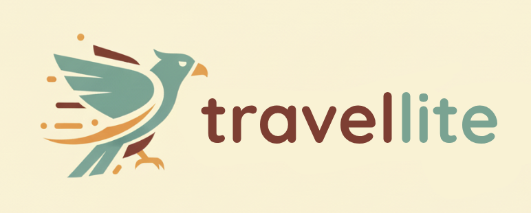

# 

A travel assistant chat app powered by Cloudflare Workers AI. Plan trips, search flights and hotels, and get destination ideas with streaming responses, per-user conversation threads, and optional real-time collaboration.

---

## What the app does

- **Chat with a travel agent** — Natural-language requests (e.g. “Plan a weekend in Austin under $800”, “Find flights NYC to LA next month”). Responses stream in real time.
- **Trip threads** — Each conversation is a “trip” thread. You can start a new trip, switch between past trips in the sidebar, and pick up where you left off. Threads are stored per user in Durable Object storage.
- **RAG (retrieval)** — When you mention a destination, the app can pull in relevant context from a Vectorize index to improve answers.
- **Amadeus tools** — The agent can call Amadeus APIs (flight search, hotel search, activities, etc.) when your message implies a booking or search; the LLM uses tool results to reply.
- **Intent and state** — The system keeps a “current intent” (e.g. “plan a trip”) so follow-up messages are treated as part of the same flow until you change topic or start a new trip.
- **Optional Realtime** — Cloudflare Realtime can be used for voice/video rooms and shared chat; the UI can join a room and receive agent messages over Realtime.

---

## How to run

### Prerequisites

- **Node.js** v18+
- **Wrangler CLI** — `npm install -g wrangler` or use the project’s `npx wrangler`
- **Cloudflare account** with Workers and Workers AI enabled
- **Secrets** — See “Secrets / environment” below

### Install

```bash
git clone <your-repo-url>
cd cf_ai_travellite
npm install
```

### Secrets / environment

Create a `.dev.vars` file in the project root (see `.dev.vars.example` if present). For local/dev, the app expects at least:

- `AMADEUS_API_KEY` / `AMADEUS_API_SECRET` — for Amadeus flight/hotel/activity APIs  
- `REALTIME_APP_ID`, `REALTIME_ACCOUNT_ID`, `CLOUDFLARE_API_TOKEN`, etc. — only if you use Realtime

Then sync those into Wrangler secrets (used in dev and deploy):

```bash
npm run set-secrets
```

This runs `node scripts/set-secrets.js`, which reads `.dev.vars` and runs `wrangler secret put ...` for each key.

### Development

```bash
npm run dev
```

This runs `set-secrets` then `wrangler dev --remote`, so:

- The Worker and Durable Objects run in Cloudflare’s preview environment (remote bindings).
- You get a local URL (e.g. `http://localhost:8787`) that proxies to that preview.
- Open the app at the path that serves the Travel Agent UI (e.g. `/` or `/agents/TravelAgent` depending on routing).

For a **fully local** dev (no remote bindings, limited Amadeus/Realtime):

```bash
npm run dev:local
```

Generate/update Worker types after changing `wrangler.jsonc` or bindings:

```bash
npm run cf-typegen
```

---

## How to deploy

1. **Secrets**  
   Ensure production secrets are set in the Cloudflare dashboard (Workers & Pages → travellite → Settings → Variables and Secrets) or via:

   ```bash
   npx wrangler secret put AMADEUS_API_KEY
   npx wrangler secret put AMADEUS_API_SECRET
   # ... etc.
   ```

2. **Deploy the Worker**

   ```bash
   npm run deploy
   ```

   This runs `wrangler deploy`, which builds and deploys the `travellite` Worker and its Durable Objects (TravelAgent, RealtimeConnector) and assets.

3. **Post-deploy**  
   - RAG: If you use Vectorize, ensure the `travellite-index` index exists and is populated (e.g. `npm run seed:rag` against your index).
   - Custom domain: Configure your domain in the Workers & Pages dashboard if you don’t want to use the default `*.workers.dev` URL.

---

## Architecture

### High-level flow

```
Browser (public/index.html)
    ↓ HTTP/SSE
Worker (src/index.ts)  ←  routes /api/agents/TravelAgent/* and /api/realtime/*
    ↓ RPC / fetch
TravelAgent Durable Object (src/travel-agent.ts)  ←  per-user state, thread storage
    ↓ prepareTurn / getState / loadTrip / startNewTrip / appendConversation
Worker runs pipeline (src/pipeline.ts)  ←  RAG + Amadeus tools + LLM
    ↓
Workers AI (streaming), Vectorize (RAG), Amadeus APIs (tools)
```

- The **Worker** is the HTTP entrypoint: it serves the frontend, handles `/api/agents/TravelAgent/*` and `/api/realtime/*`, and forwards RPC to the TravelAgent DO.
- The **TravelAgent** Durable Object holds per-user (per-session) state: current trip id, list of trip threads, and recent messages. It uses **Durable Object storage** (key-value) to persist trip threads so they survive restarts and reloads.
- **Stream path**: User sends a message → Worker calls TravelAgent `prepareTurn(message)` (intent/new-trip handling, state load) → Worker runs **pipeline** (RAG + tools + LLM) in `src/pipeline.ts` → Worker streams the LLM response back → Worker calls TravelAgent `appendConversation(userMsg, assistantMsg)` to persist the turn.

### Main components

| Component | Role |
|-----------|------|
| **Worker** (`src/index.ts`) | Serves static assets, routes API requests, calls TravelAgent DO via `routeTravelAgentRequest`, runs stream/state/loadTrip/startNewTrip/clear handlers, Realtime token/send/webhook. |
| **TravelAgent DO** (`src/travel-agent.ts`) | One instance per user (session id). In-memory: current thread messages, basics, preferences, currentIntent. Persists threads in DO storage (`thread:*`, `threads`, `currentThreadId`). Exposes RPC: `getState`, `prepareTurn`, `loadTrip`, `startNewTrip`, `appendConversation`, `clearRecentMessages`. |
| **Pipeline** (`src/pipeline.ts`) | `runPipeline(env, message, tripState)`: optional RAG (Vectorize) and Amadeus tools in parallel, then `generateLLMResponse` (Workers AI streaming). Uses `classifyConversation` for intent and “new trip” detection. |
| **Amadeus client** (`src/amadeus-client.ts`) | Wraps Amadeus REST APIs (flights, hotels, activities, etc.) used by the pipeline tools. |
| **RealtimeConnector DO** (`src/realtime-connector.ts`) | Optional: bridges agent output to Cloudflare Realtime rooms (e.g. for shared sessions). |
| **Frontend** (`public/index.html`) | Single-page UI: trip threads sidebar (“Trip threads”), “New trip” button, main chat (shows selected thread’s messages), streaming input, optional Realtime integration. |

### API surface (Worker)

- `GET /`, `GET /agents/TravelAgent` — serve frontend.
- `POST /api/agents/TravelAgent/stream` — send a message; returns SSE stream (pipeline run in Worker, state from DO).
- `GET /api/agents/TravelAgent/state?sessionId=...` — get state (trips list, current thread, recent messages) for sidebar.
- `POST /api/agents/TravelAgent/loadTrip` — body `{ sessionId, tripId }`; switch current thread.
- `POST /api/agents/TravelAgent/startNewTrip` — save current thread and start a new one.
- `POST /api/agents/TravelAgent/clear` — clear recent messages for the session.
- `GET /api/realtime/token` — Realtime auth token; `POST /api/realtime/send` — inject message into Realtime flow; webhook/connect for Realtime callbacks.

### Data and storage

- **Trip threads** — Stored in the TravelAgent Durable Object’s key-value storage: `currentThreadId`, `threads` (list of `{ id, title, createdAt }`), and `thread:<id>` (full thread: messages, basics, preferences, currentIntent). No SQLite required for threads.
- **RAG** — Vectorize index `travellite-index`; pipeline queries it when the message suggests a destination.
- **KV** — Optional (e.g. RAG or app-specific key-value data); bound as `KVNAMESPACE` in `wrangler.jsonc`.

---

## Project structure

```
cf_ai_travellite/
├── public/
│   ├── index.html          # Main Travel Agent UI (chat + trip threads sidebar)
│   └── ...                 # Static assets (images, etc.)
├── src/
│   ├── index.ts            # Worker entry: routing, stream/state/loadTrip/startNewTrip/clear, Realtime
│   ├── travel-agent.ts     # TravelAgent Durable Object (state, threads, RPC)
│   ├── pipeline.ts         # RAG + tools + LLM pipeline, intent classification
│   ├── amadeus-client.ts   # Amadeus API client
│   ├── realtime-connector.ts # RealtimeConnector Durable Object
│   └── types.ts            # Shared types
├── scripts/
│   └── set-secrets.js      # Writes .dev.vars into Wrangler secrets
├── wrangler.jsonc          # Worker config (assets, AI, Vectorize, KV, Durable Objects)
├── package.json
└── README.md
```

---

## Scripts reference

| Script | Description |
|--------|-------------|
| `npm run dev` | Set secrets from `.dev.vars` and start `wrangler dev --remote` |
| `npm run dev:local` | Local dev only (`wrangler dev`, no remote bindings) |
| `npm run deploy` | Deploy Worker and Durable Objects to Cloudflare |
| `npm run set-secrets` | Push `.dev.vars` into Wrangler secrets |
| `npm run cf-typegen` | Regenerate Worker types (`wrangler types`) |
| `npm run check` | TypeScript check + `wrangler deploy --dry-run` |
| `npm run seed:rag` | Seed Vectorize index (if applicable) |

---

## Resources

- [Cloudflare Workers](https://developers.cloudflare.com/workers/)
- [Workers AI](https://developers.cloudflare.com/workers-ai/)
- [Durable Objects](https://developers.cloudflare.com/durable-objects/)
- [Vectorize](https://developers.cloudflare.com/vectorize/)
- [Amadeus for Developers](https://developers.amadeus.com/)
